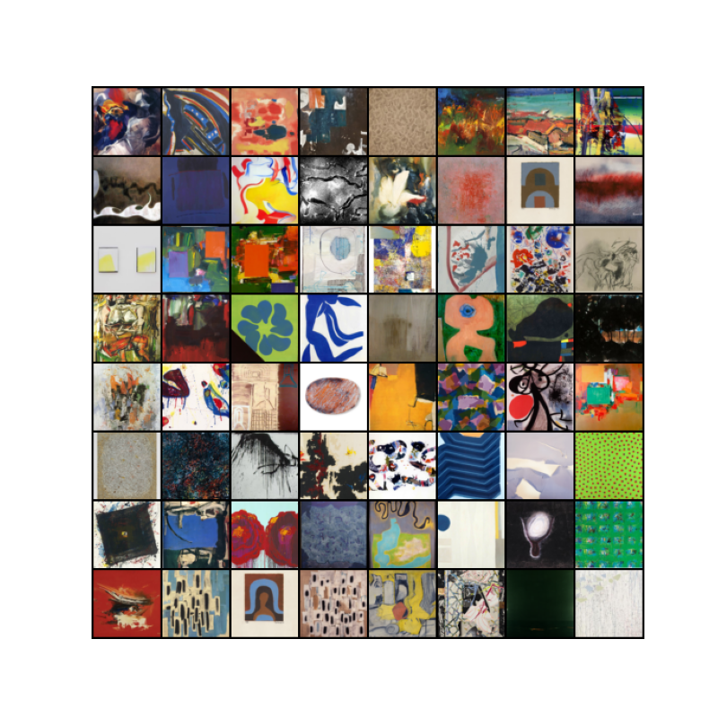

# UE4 Deep Learning Project: Generative Adversarial Networks (GANs)

**Name: Abhishek PURANDARE**

## Installation
Pytorch installation should be enough, along with Tensorboard (optional)
```bash
conda install pytorch torchvision pytorch-cuda=11.6 -c pytorch -c nvidia
```
```bash
conda install -c conda-forge tensorboardx
```
### OR
### Make a conda environment from a yaml file (this will take longer).
```bash
conda create -n gan-venv -f conda-venv.yaml
```

## Dataset
This data set contains 2782 abstract images scraped from wikiart.org.

click [here](https://www.kaggle.com/datasets/bryanb/abstract-art-gallery?resource=download) to download.



## Configuration and Tuning
[config.yaml](config.yaml) is used for setting hyperparameters, configurations, and dataset paths.


## Training

- Train DCGAN using `python train_dcgan.py`
- Train WGAN using `python train_wgan.py`

Both share the same parameters set in the `config.yaml` with a few additional parameters for WGAN.

_The training was done on local GPU: NVIDIA RTX A1000. It is highly recommended to train the model on GPU(s) as it takes a long time regardless._

## Inference

You can look at the [inference.ipynb](inference.ipynb) to check how to load the model and do the inference.

_Also, all the models, and tensorboard logs are stored inside_ `final/`

## Summary and Results


### Deep Convolutional GAN (DCGAN)
#### Summary
- I chose DC-GANs as the architecture to implement since CNN architectures have proven to be efficient for image data.
- The main challenge of the problem is the data itself. There is a lot of variance between the abstract images. We can say that it is mostly random and has no similarities between images. Thus, the generator produces unknown patterns after training. I trained a model on a smaller dataset to ensure that everything worked as expected before jumping onto the large dataset of 2782 images.
- For the main training, I kept `batch_size=128`, and `lr=1e-4` for both the generator and discriminator.

- I performed a train test split of 80:20 over 2782 images.

- It took around `09:00:00+` to train for 700 epochs.

#### Results
**The training and evaluation metrics are in the following links to tensorboard.dev,**

_Training was done in two parts: (500 + 200) epochs_

1. [500 epochs](https://tensorboard.dev/experiment/XLeJV1c9R1abwJN5D8ES3Q/#)
2. [200 epochs](https://tensorboard.dev/experiment/7Lmwg7dxRj2kkU67cemoEA/#)


- From the above outputs, we can clearly see that the generator is not able to obtain results that are similar to the real images. This clearly shows that the discriminator stops providing good feedback to the generator. This is a vanishing gradients issue.

- As the training continues, the generator produces similar results, i.e., mode collapse happens when the generator is not able to learn the diversity in the data.

- If you see the results from the above tensorboard link, there is also unstable behavior in this GAN as we are not working on images with similar features (like face images). It may be possible that the output coming from the generator might be seen as real. But, the `fake_score` gets lower as we train for a longer period, whereas in an ideal case, both scores should be converging towards 0.5.

- I trained the models for an additional 200 epochs. But, there was no improvement in the generator's output.

### Wasserstein GAN (WGAN)


#### Summary
- To improve the generator's outputs, I implemented Wasserstein GAN from the previous DC-GAN models to tackle some of the issues.

- Wasserstein GAN tries to tackle the issues of vanishing gradient and mode collapse using Earth Mover's distance. The earth mover's distance computes the cost between real image distribution and fake image distribution and tries to make the distributions more similar.

- To improve the discriminator, we remove the last sigmoid layer, and only keep a linear layer at the end of the neural network. Thus, it will not produce a score for real or fake anymore but instead will give a large number if the image is real.

- By removing the constraint, the loss function is not bound between 0 and 1. It will grow as far as it can based on the distance between two distributions.

- WGAN uses 1-Lipschitz function to compute this distance. We can either implement it using,
  - Weight Clipping
  - Gradient Penalty

- I have added both techniques. However, I did not fully explore the weight clipping option as it did not yield good results while experimenting.

- Gradient Penalty yielded good results for my preliminary run on a small dataset. I chose this option for my final training.

- Memory requirements have changed somewhat. I kept `batch_size=32`, and `lr=1e-4`

- The training took longer than expected. Around `12:00:00+` for the first 300 epochs. Evidently, this is because of the gradient penalty, which is computationally expensive.

#### Results

**The training and evaluation metrics are in the following links to tensorboard.dev,**

_Training was done in three parts: (300 + 100 + 400) epochs_

1. [300 epochs part 1](https://tensorboard.dev/experiment/Uq7hd0D9SGW8rsGMR7kOyA/#)
2. [100 epochs part 2](https://tensorboard.dev/experiment/O9jdCBnjSB2s2659lS4NKw/#)
3. [400 epochs part 3](https://tensorboard.dev/experiment/rQ66O94TQRWR8rdlJhMTow/#)


- We can see that by removing the constraint on the loss function, the generator is able to produce good results (even better than dcgan with 500 epochs) within the first few (50) epochs. As the training continues, the generator picks up on certain patterns like squares and some abstract shapes (squares and stripes). It is also able to pick the color combinations that appear in the real images. But it looks mostly random.

- Even though the discriminator's loss kept increasing, the generator appears to have saturated after 500+ epochs where it generates similar images. We see some details increasing in the fake images, but it is not significant.

## Conclusion

- Overall, we can see improvements in the second implementation (WGAN), but at the cost of computing the gradient penalty, which takes a huge amount of training time. Probably around 4-5 times more compared to normal DCGAN for the same amount of epochs. In hindsight, a size of 64 x 64 would have been sufficient for the input size of the image. But I chose 128 x 128 in hopes of seeing better image generation.

- Secondly, I believe the dataset was not good for generalizing to any specific feature of the image. The generator did not have enough samples to pick on any particular patterns such as shapes, colors, etc. The images do look like abstract images.

- It was the right choice to train the model on a smaller dataset beforehand to make good assumptions on the hyperparameters and make decisions wisely considering how expensive it is to train generative models.
